# Numerical Mathematics


## Homework assignment 1

As part of the first assignment, we were tasked to implement a couple of data structures for sparse matrices (Linear Algebra):

1. BandMatrix
2. UpperBandMatrix
3. LowerBandMatrix

A **band matrix** is a sparse matrix whose non-zero entries are confined to a diagonal band, comprising the main diagonal and zero or more diagonals on either side.

Similarily, **upper band** and **lower band** matrices contain non-zero diagonals only on the main diagonal and zero or more diagonals above or below the main diagonal, respectively.

Each data structure should contain some algebraic operations and algorithms:

1. Accessing and mutating elements by index (subscripts).
2. Multiplication of matrix with a vector.
3. _Division_ from the left (solving linear systems of equations).
4. LU decomposition of a matrix.

Taking advantage of the fact that these matrices are sparse we should provide optimized versions of algorithms.

Additionally, to make our library more complete, we provide some supplementary data structures and operations on them which are essential for any linear algebra library.

### Project structure

```
├── README.md
├── Sources
│   ├── SwifyPy
│   │   └── Time
│   │       └── time.swift
│   │   ├── Python
│   │   │   └── Python.swift
│   │   ├── CopyOnWrite
│   │   │   └── cow.swift
│   │   ├── LinearAlgebra
│   │   │   ├── Protocols
│   │   │   │   ├── DefaultValueInitializable.swift
│   │   │   │   ├── MatrixProtocol.swift
│   │   │   │   └── Transposable.swift
│   │   │   ├── Algorithms
│   │   │   │   ├── LUDecomposition.swift
│   │   │   │   ├── Laplace2D.swift
│   │   │   │   └── argmax.swift
│   │   │   └── Vector.swift
│   │   │   ├── Matrix.swift
│   │   │   ├── BandMatrix.swift
│   │   │   ├── UpperBandMatrix.swift
│   │   │   ├── LowerBandMatrix.swift
│   └── SwifyPyRun
│       └── main.swift
├── Tests
│   ├── LinuxMain.swift
│   └── SwifyPyTests
│       ├── BandMatrixTests.swift
│       ├── LUSolverTests.swift
│       ├── Laplace2DTests.swift
│       ├── LowerBandMatrixTests.swift
│       ├── MatrixTests.swift
│       ├── UpperBandMatrixTests.swift
│       ├── VectorTests.swift
│       └── XCTestManifests.swift
└── docs
```

### Solving the boundary problem for Laplace equation in 2D

To validate our implementation, we compute the approximate solution to the boundary problem for the Laplace equation in 2D inside the rectangle bounded by `(a, b) x (c, d)`.

```swift
let (Z, x, y) = Laplace2D.solveBoundaryProblem(
  fs: sin,
  fd: neg(sin),
  fz: sin,
  fl: neg(sin),
  h: 0.075,
  bounds: ((0, .pi), (0, .pi)
)
```

We plot the output of the algorithm to obtain a 3D surface:

```swift
surface(x: x, y: y, Z: Z)
```

and obtain:

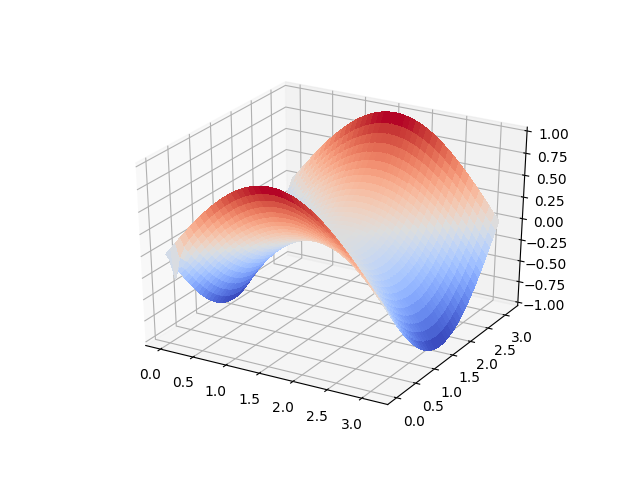

For drawing, we use Python's awesome `matplotlib` library. To do that, we integrate [PythonKit](https://github.com/pvieito/PythonKit) Swift library.

## Homework assignment 2

As part of the second assignment, we were tasked with implementing an algorithm for calculating eigenvalues and eigenvectors of a symmetric matrix. The algorithm is iterative and works as follow:

1. Compute a Hessenberg decomposition `A = Uᵀ T U` where `A` is symmetric.
2. For tridiagonal matrix `T` repeat until `T𝗇˗₁,𝗇` is sufficiently small:
 * for `T - μI`, `μ = T𝗇,𝗇` compute QR decomposition.
 * next approximation is `T = RQ + μI`
3. Repeat step 2. for submatrix T without last row and column.

We are required to implement a QR decomposition algorithm as well, using Givens rotations. 

A couple of data structures are also implemented:

1. Symmetric band matrix
2. Symmetric tridiagonal matrix

To validate our solution, we test the algorithm on a Laplace similarity matrix of a combination of three normally distributed sets of points.

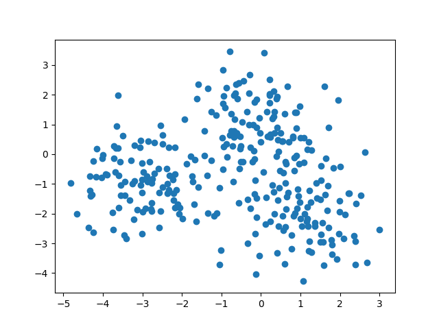
*Fig. 2: Normally distributed set of points.*

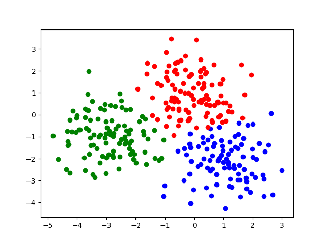
*Fig. 3: Points grouped into three groups using kmeans.*

Laplace matrix is a very sparse matrix, as we can see in the following diagram:

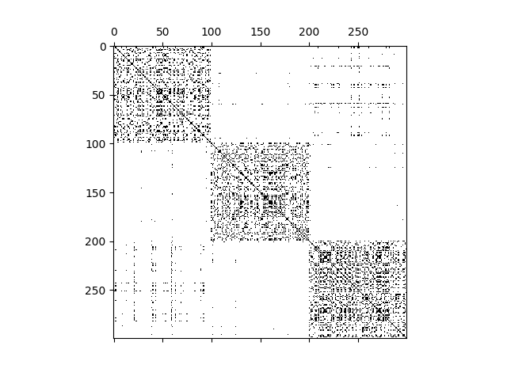
*Fig. 4: Sparsity of the Laplace matrix.*

We compute the eigenvalues of a 300x300 matrix in ~24seconds (~15 slower than Julias implementation).

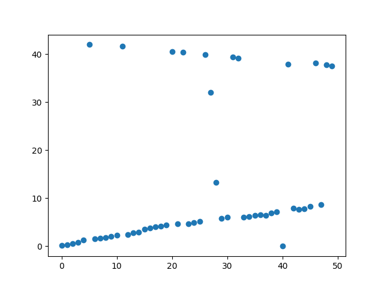
*Fig. 5: First 50 eigenvalues of the Laplace matrix.*

## Homework assignment 3

### 1. Sine integral

Compute the value of

```math
Si(x) = \int_{0}^x \frac{sin(t)}{t} dt
```
accurate to 10 decimal places.

#### Solution

Our first attempt of computing the integral is by approximating it with a Taylor polynomial:

```math
Si(x) = x - \frac{x³}{3!} + \frac{x⁵}{5!} - ...
```

We observe that this method efficiently computes `Si(x)` for `x` up to `~20` with a relatively small number of coefficients. The following table shows the results:

| x | Si(x) | Taylor | n | Si(x) - Taylor | Time [s] |
|---|-------|----------------|---|-------|---|
| 1.0 | 0.9460830703 | 0.946083070367183 | 10 | 6.71829258891421e-11 | 0.0000 |
| 2.0 | 1.6054129768 | 1.6054129768026926 | 10 | 2.6925128793209296e-12 | 0.0000 |
| 3.0 | 1.8486525279 | 1.848652527989875 | 10 | 8.98749963340606e-11 | 0.0000 |
| 4.0 | 1.7582031389 | 1.7582031389490536 | 15 | 4.9053650030828067e-11 | 0.0000 |
| 5.0 | 1.5499312449 | 1.5499312449446916 | 15 | 4.4691583767075826e-11 | 0.0000 |
| 6.0 | 1.4246875512 | 1.4246875512855488 | 15 | 8.554890129630621e-11 | 0.0000 |
| 7.0 | 1.4545966142 | 1.4545966148410763 | 15 | 6.410763031539091e-10 | 0.0000 |
| 8.0 | 1.5741868217 | 1.5741868217069346 | 20 | 6.934675056413653e-12 | 0.0000 |
| 9.0 | 1.6650400758 | 1.6650400758286859 | 20 | 2.8685942510264795e-11 | 0.0000 |
| 10.0 | 1.6583475942 | 1.6583475941496273 | 20 | 5.037281702868768e-11 | 0.0000 |
| 15.0 | 1.6181944437 | 1.6181944437141316 | 30 | 1.4131584791243768e-11 | 0.0000 |
| 20.0 | 1.548241701 | 1.5482417006385358 | 35 | 3.614641919114092e-10 | 0.0000 |
| 30.0 | 1.56675654 | 1.5667530342406735 | 100 | 3.5057593266163423e-06 | 0.0000 |

As we can see, starting at `x = 30`, even for large `n`, the error remains relatively big. 

Next, we implement three algorithms for general numerical integration:

  1. Trapezoidal rule
  2. Simpson's rule
  3. Romberg's method
 
To rank them we observe how their accuracy changes with regard to `k`. Here are the results:

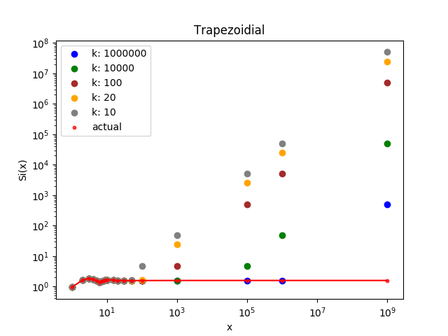
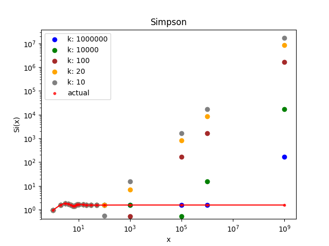
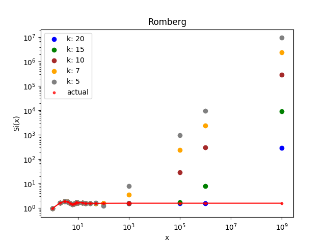

Romberg's method is the winner when we consider just `k`. But we must also consider algorithms' time complexities with regard to `k`. Both trapezoidal and Simpson's rules have time complexity of `O(k)`. Romberg's method, however, has time complexity `O(2ᵏ)`!

Therefore, to conclude which algorithm performs best, we analyze running times of all three methods as well (note that we transformed `k` to `2ᴷ` for Romberg's method):

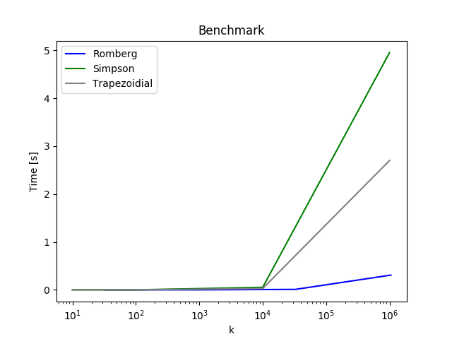

We conclude that Romberg's method is the best both in accuracy and in speed.

---

We also compare the running times of Romberg's method and Taylor's expansion solution for small inputs to see if Taylor expansion is faster. If that is the case, our final solution could use Taylor expansion for small inputs and Romberg's method for large ones (large being greater then 20 here). The following plot displays benchmarks results:

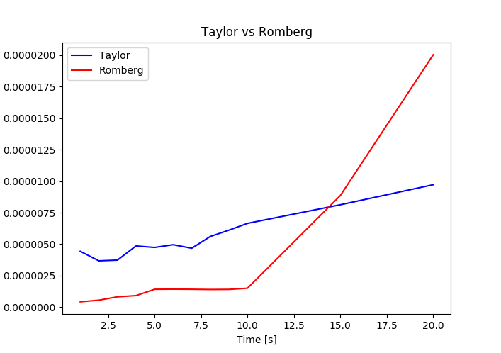

Turns out that Romberg's method is even faster than Taylor's expansion for _really_ small inputs, so we conclude, that plain Romberg's method is the most suitable!

---

Using Romberg's method, we accurately compute `Si` from `x = 1` to `x = 1000000`, as shown in the following table:

| x | Si(x) | Romberg | n | Si(x) - Romberg | Time [s] |
|---|-------|----------------|---|-------|---|
| 1.0 | 0.9460830703 | 0.9460830703872225 | 3 | 8.722245148362617e-11 | 0.0000 |
| 2.0 | 1.6054129768 | 1.6054129768005054 | 4 | 5.053735208093713e-13 | 0.0000 |
| 3.0 | 1.8486525279 | 1.8486525279994788 | 5 | 9.947886958627805e-11 | 0.0000 |
| 4.0 | 1.7582031389 | 1.7582031389484194 | 5 | 4.841949063916218e-11 | 0.0000 |
| 5.0 | 1.5499312449 | 1.5499312449446776 | 6 | 4.467759495696555e-11 | 0.0000 |
| 6.0 | 1.4246875512 | 1.424687551280575 | 6 | 8.057510214598551e-11 | 0.0000 |
| 7.0 | 1.4545966142 | 1.4545966142487512 | 6 | 4.8751225278920174e-11 | 0.0000 |
| 8.0 | 1.5741868217 | 1.5741868217105481 | 6 | 1.0548228956963612e-11 | 0.0000 |
| 9.0 | 1.6650400758 | 1.665040075840436 | 6 | 4.04360989136876e-11 | 0.0000 |
| 10.0 | 1.6583475942 | 1.6583475942231185 | 6 | 2.311839608637456e-11 | 0.0000 |
| 15.0 | 1.6181944437 | 1.6181944437083673 | 9 | 8.367306847389955e-12 | 0.0000 |
| 20.0 | 1.548241701 | 1.5482417010434406 | 10 | 4.34405844629282e-11 | 0.0000 |
| 30.0 | 1.56675654 | 1.5667565400303503 | 10 | 3.0350166824177904e-11 | 0.0000 |
| 50.0 | 1.5516170724 | 1.5516170724859368 | 10 | 8.593681322111024e-11 | 0.0000 |
| 100.0 | 1.5622254668 | 1.562225466889506 | 10 | 8.95059582006752e-11 | 0.0000 |
| 1000.0 | 1.5702331219 | 1.5702331219702594 | 13 | 7.025935389037841e-11 | 0.0001 |
| 100000.0 | 1.5708063203 | 1.570806320401432 | 19 | 1.0143197393119863e-10 | 0.0100 |
| 1000000.0 | 1.57079539 | 1.5707953900428788 | 30 | 4.287881161246787e-11 | 22.1300 |

---

In our implementation we provide an easy-to-use API for computing integrals of any function. For instance:

```swift
// compute the integral of `f(x) = x²` from 0 to 10
1> let f = Function { pow(2.0, $0) }
2> print(f.integrate(on: (0, 10), n: 5))
333.3333333333333
```

By default Romberg's method is used for integration. We can also use a different method:

```swift
// compute the integral of `f(x) = x²` from 0 to 10 using Simpson's rule
1> let f = Function { pow(2.0, $0) }
2> print(f.integrate(on: (0, 10), n: 5, method: .simspon))
333.3333333333333
```

### 2. Gravity

Compute the force between two parallel unitary homogenous cubes distanced 1. Assume that all physical constants equal 1. The force between two objects `T1, T2 ∈ ℝ³` is:

```math
F = \int_{T1} \int_{T2} \frac{r₁-r₂}{‖r₁-r₂‖²}dr₁dr₂.
```

#### 1. Naive solution

Sample predefined number of uniformly distributed points from both cubes, sum forces between every pair and calculate mean.

Gravity between two points is:

```math
F𝗉 = \frac{r₁-r₂}{‖r₁-r₂‖³}
```

We expect that this approach converges toward the actual result as the number of sampled points approaches infinity. The running time of this algorithm is `O(n⁶)` (`n` is number of sampled points along an axis). The following plot shows how the error changes depending on the size of the sample:

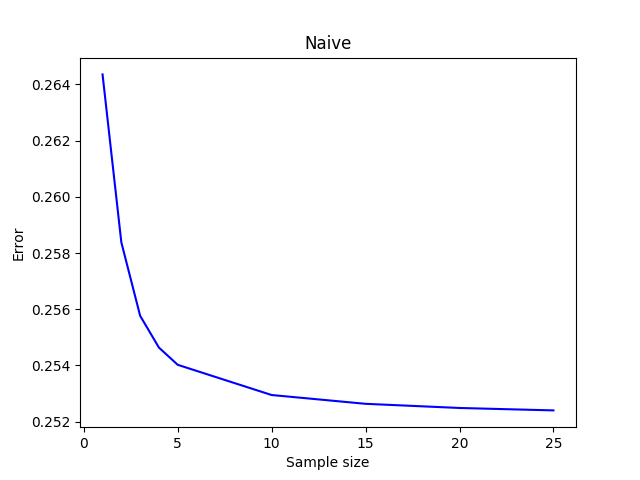

#### 2. Naive solution*

Because of the symmetry, forces between non-parallel points relative to the x-axis get canceled out, therefore we can reduce the naive algorithm's performance to `O(n⁴)`. We do this by still sampling `n³` points from one cube, but only sample `n` points from the second (points parallel to the x-axis). The accuracy of the algorithm itself does not change, however, we can calculate the gravity with `𝛩(n√n)` points with the same running time. Here are the results:

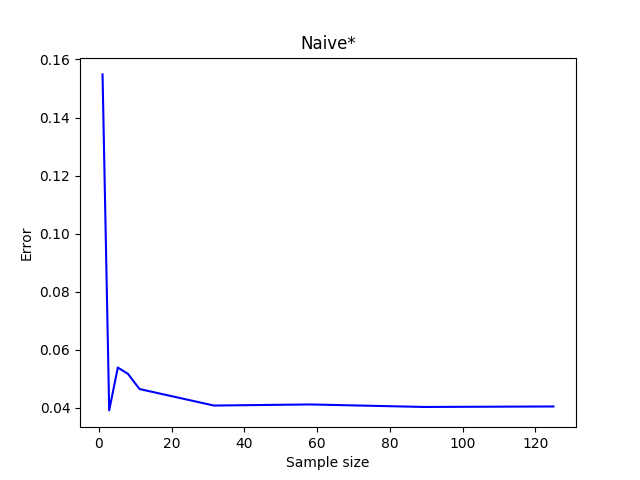

#### 3. Plain Monte Carlo

The plain Monte Carlo algorithm samples points randomly from the integration region to estimate integral. Using this algorithm, the approximate force is calculated by,

```math
F = \frac{1}{N}\sum_{i}^N F_p
```
[1].

The time complexity of this algorithm is `O(N)`. The following plot displays the error with respect to `N`:

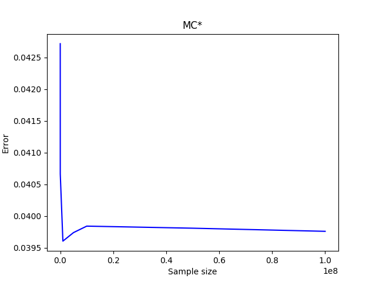


#### 4. Approximating the integral using Gauss-Chebyshev quadrature

Instead of uniformly sampling points form the cubes, we compute the force at `n` precisely defined points and compute the force as a weighted sum:

```math
F ≈ \sum_{x1}^n \sum_{y1}^n \sum_{z1}^n \sum_{x2}^n \sum_{y2}^n \sum_{z2}^n 𝑤_𝚒 * F_𝗉(x_𝚒)
```

We sample the points from the cubes at the so-called _Chebyshev nodes_, which are roots of the Chebyshev polynomial [3].

*Chebyshev nodes of the first kind* on the interval `(-1, 1)` are given by

```math
x_𝚒 = cos(π\frac{2i - 1}{2n})
```

and their weights by

```math
𝑤_𝚒 = 1 / n.
```

*Chebyshev nodes of the second kind* on the interval `(-1, 1)` are given by

```math
x_𝚒 = cos(\frac{πi}{n + 1})
```

and their weights by

```math
𝑤_𝚒 = \frac{π}{n + 1} * sin^2(\frac{πi}{n + 1})
```

[3]


To convert nodes to an arbitrary interval `[a, b]` we use the following formula:

```math
x_i = 0.5 * (a + b) + 0.5 * (b - a) * cos(π * \frac{2i - 1}{2n})
```

For us, the relevant interval is `[0, 1]`.

The following two graphs display the results:

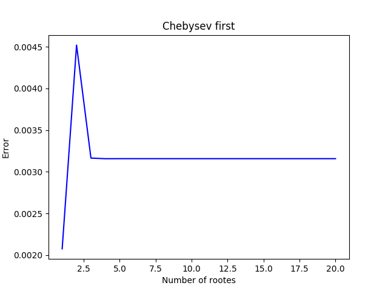


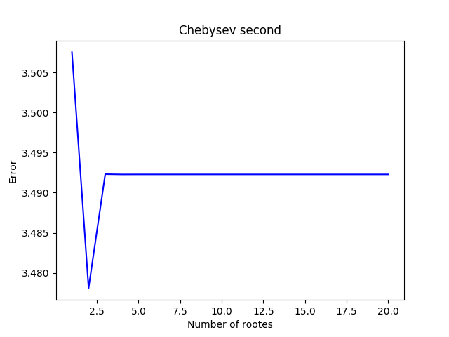

Interestingly, approximation using Chebyshev-Gauss quadrature with nodes of the 1st kind is accurate to two digits even with just one node, but it doesn't seem to converge closer after that.


#### 5. Approximating the integral using Gauss-Legendre quadrature

Gauss-Legendre quadrature approximation is very similar to Gauss-Chebyshev approximation. The classical method for computing its nodes and weights is `Golub-Welsch` algorithm. It reduces the problem to a symmetric tridiagonal eigenvalue problem. The following _pseudocode_ describes the algorithm [5]:

```
function jacobi(n) -> J {
  // returns a symmetric band matrix with zeros on the diagonal
  beta = 0.5 * sqrt(1 - (2 * i)²) for i in [1, n)
  J = diag(beta, 1) + diag(beta, -1)
}

function gaussLegendreNodesAndWeights(n) -> (x, w) {
  J = jacobi(n)
  (V, M) = eigen(J) // V contains eigenvalues, M is an eigenmatrix
  x = V // eigenvalues are Gauss nodes
  w = 2 * V[0, i]² for i in [0, n) // weights
}
```

We must not forget to convert nodes from `[-1, -1` to `[0, 1]`!

The convergence of Gauss-Legendre quadrature is really fast, as shown in the following table:

|Gauss-Legendre | Points | Time [s] |
|---|---|---|
| -0.25| 1 | 0.010 |
| -0.24668564220790112| 2 | 0.028 |
| -0.24792619217030515| 3 | 0.068 |
| -0.24792275902368735| 4 | 0.199 |
| -0.24792296453612947| 5 | 0.621 |
| -0.24792296933825006| 6 | 1.492 |
| -0.2479229691611038| 7 | 3.481 |
| -0.2479229691664091| 8 | 7.613 |
| -0.24792296916635914| 9 | 15.221 |
| -0.2479229691664131| 10 | 28.556 |
| -0.24792296916635959| 11 | 52.713 |

As we are interested in 10-digit accuracy only, we conclude with our best guess that the value of the force is `[-0.2479229691, 0, 0]` (we use this value when we analyze our other solutions).

#### References

[1] https://www.gnu.org/software/gsl/doc/html/montecarlo.html

[2] https://en.wikipedia.org/wiki/Chebyshev%E2%80%93Gauss_quadrature

[3] https://en.wikipedia.org/wiki/Chebyshev_nodes

[5] https://www.mathworks.com/matlabcentral/mlc-downloads/downloads/submissions/23972/versions/22/previews/chebfun/examples/quad/html/GaussQuad.html

## Homework assignment 4

### Mathematical pendulum

Angular displacement of a pendulum can be described with the following differential equation:

```math
\frac{g}{l} * sin(\theta(t)) + \theta''(t) + μ * \theta'(t) = 0.
```

Coefficient $ -μ * 𝜃'(t) $ represents _loss of energy_ (air resistance, friction, ...), which is negatively proportional to the velocity. When `μ` equals `0`, there is no loss of energy.

We transform the 2nd order DE to a system of two 1st order DE:

```math
\frac{d}{dt}\begin{bmatrix}
\theta(t)\\
\theta'(t)\\
\end{bmatrix} = \begin{bmatrix}
\theta'(t)\\
\theta''(t)\\
\end{bmatrix},
```

```math
\frac{d}{dt}\begin{bmatrix}
\theta(t)\\
\theta'(t)\\
\end{bmatrix} = \begin{bmatrix}
\theta'(t)\\
-\frac{g}{l} * sin(\theta(t)) - μ * \theta'(t)\\
\end{bmatrix}.
```

---

Using above equations, we can draw a vector field where at each point in 2D space a vector represents an abstract _direction_ of the pendulum - how will the angle and the velocity change in the near future:

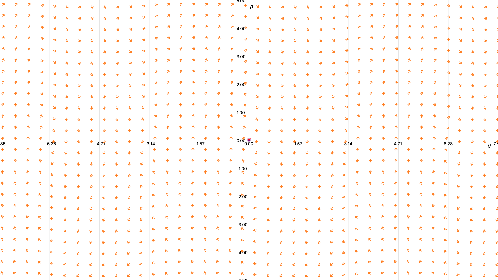

The x-axis represents _angle_ and the y-axis _velocity_.

The arrows in the above vector field are normalized. The following plot shows the magnitude of the vector at $x = pi / 2$, $y = 3$:

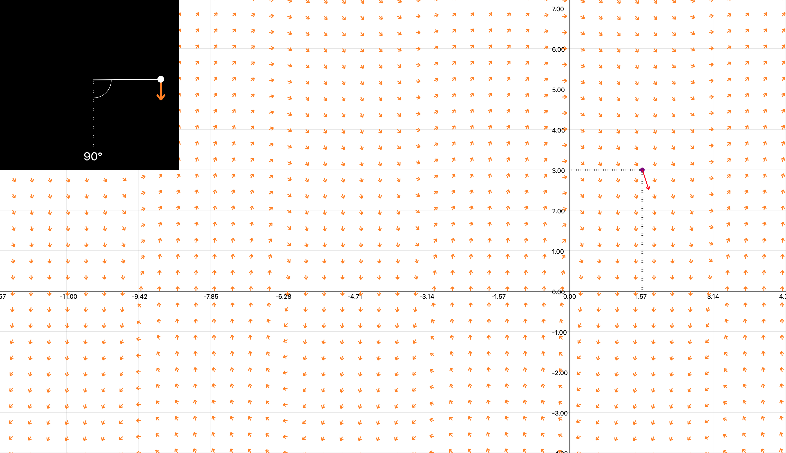

When we run the simulation we see that the pendulum traces an elipse-like shape:

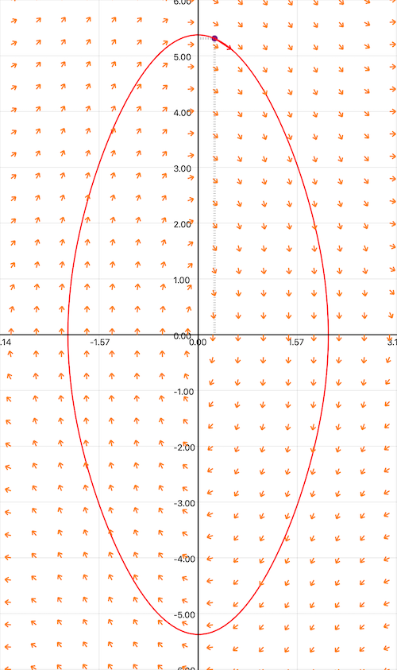

---

We also compare the mathematical pendulum with the harmonic pendulum, which follows the following equation:

```math
\theta(t) = \theta * cos(\sqrt(\frac{g}{L}) * t).
```

For small initial angles and initial velocities close to zero, the above approximation is almost exact. The following plot displays how the angles change over time of both mathematical (green) and harmonic (red) pendulums for $theta_0 = 15º$, $velocity_0 = 0$:

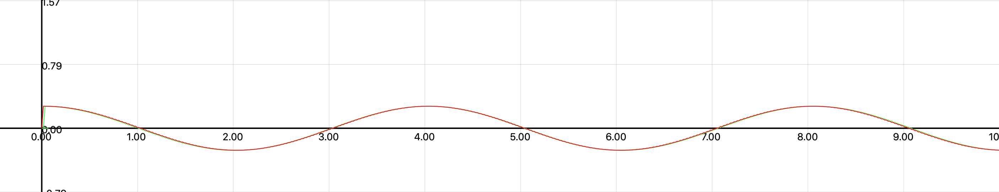

The following plot displays how the angles change for $theta_0 = 135º$, $velocity_0 = 0$, where we can see that the approximation is actually very far off:

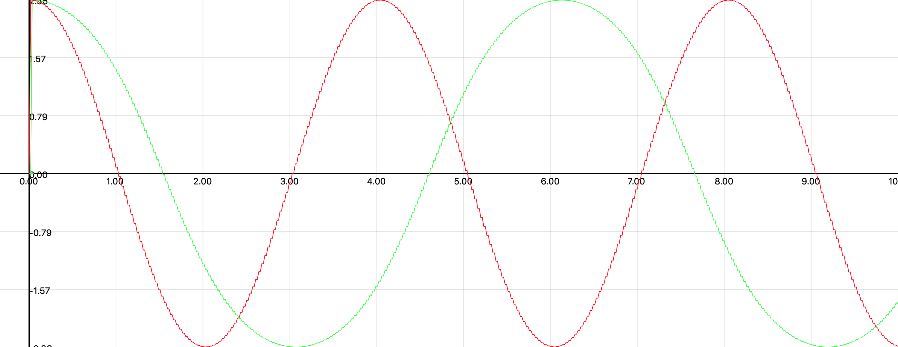

---

Above simulations were performed with the energy-loss coefficient ($μ$) being zero. If we run the pendulum trajectory simulation again, but with $μ > 0$, we see that the trajectory follows a spiral instead of an elipse:

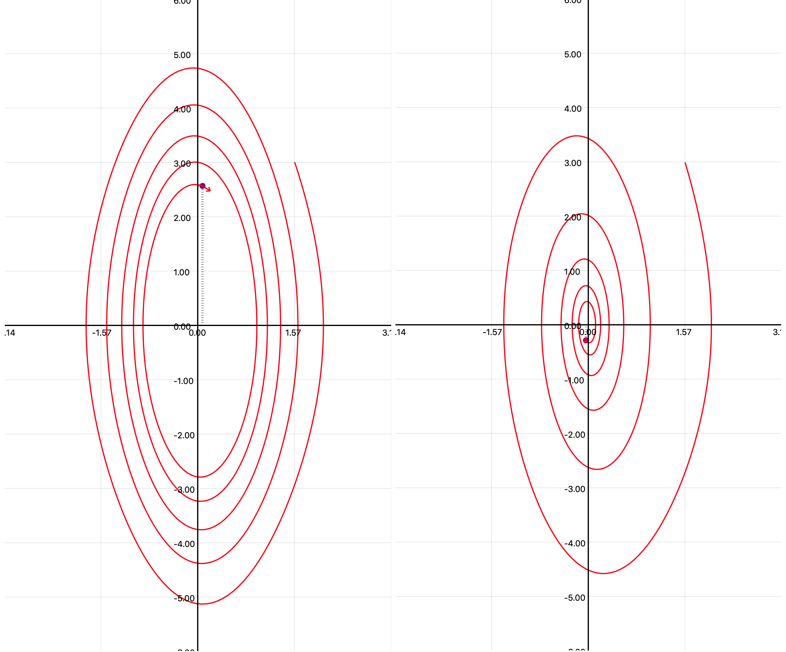

## Building and running the project

1. Clone the repository: 

	```bash
	$ git clone https://gitlab.com/nummat/nummat-1920.git
	```

2. Make sure Swift 5.1 is installed:

	```bash
	$ swift --version
	  Apple Swift version 5.1.3 (swiftlang-1100.0.282.1 clang-1100.0.33.15)
	  Target: x86_64-apple-darwin19.3.0
	
	on macOS
	
	or
	
	  Swift version 5.1.5 (swift-5.1.5-RELEASE)
	  Target: x86_64-unknown-linux-gnu
	
	on Ubuntu (Linux)
	```

	If you don't have Swift installed follow [Linux installation guidlines](https://itsfoss.com/use-swift-linux/).

3. Build and run (or test):

	```bash
	$ cd src/Dn1-toni/Numeric/
	$ swift build -c release
	$ swift run -c release
	$ swift test
	```
	
## Base repository

https://gitlab.com/seckmaster/numeric
